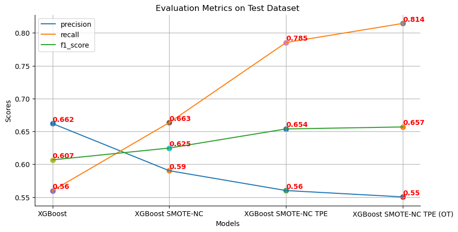
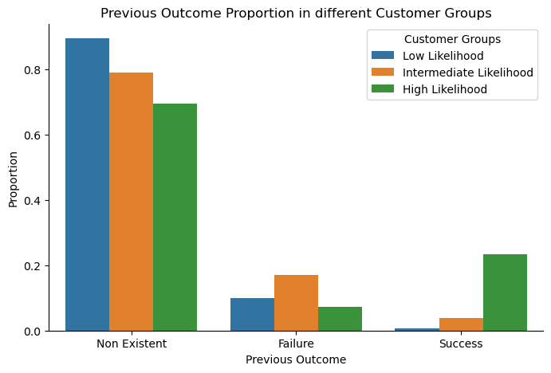
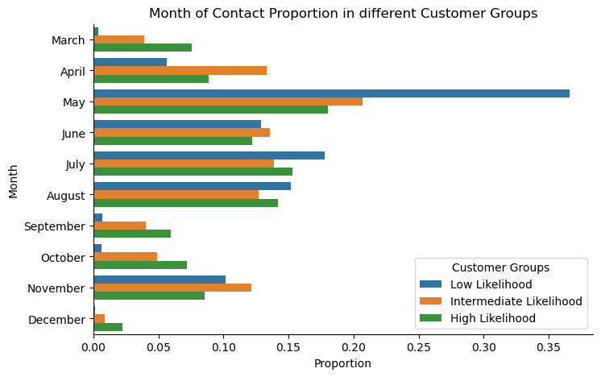
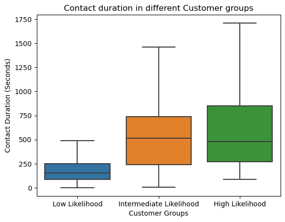
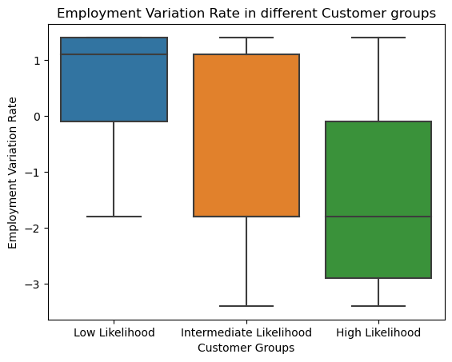

# Overview and Objectives

A telecommunication business recently began a marketing campaign to encourage clients to sign up for their new subscription plan. The organization is looking for help in developing a complete understanding of its consumers and identifying the client group that are most responsive to marketing initiatives.

The project consists of 2 main phases: 

**1. Exploratory Data Analysis**: Gain a comprehensive understanding of the dataset, which includes statistical descriptive, univariate analyis, bivariate analysis and multivariate analysis.

**2. Developing Machine Learning Models**: The project developed and bencmarked various models to classification whether a customer will subscribe to the marketing campagin or not. Based on predicted results, customers will then be segmented into different groups to gain deeper insights and optimization strategies.

# Dataset

The dataset can be downloaded [here](https://drive.google.com/file/d/113_wcUa5BkKZico4ySDSe-wFzWajgHKL/view?usp=drive_link). It consists of **41,180 samples** with **21 features** that describe details of each customer, from personal information (age, martial status, occupation, etc.) to interaction history (contacted times, contact durations, etc.)

# Methodologies

## Exploratory Data Analysis
The EDA stage can be summarised as:
- Data cleaning (identifying missing values, duplicated values, outliers, etc.)
- Univariate Analysis (Distribution plot, Log transformation, IQR outliers detection, etc.)
- Bivariate Analysis (Kernel Density Estimation analysis, Spearman rank matrix correlation, Hypothesis testing, ...)

## Model Development
Various machine learning models were experimented, which includes:
- Linear Regression
- Decision Tree
- Random Forest
- XGBoost

Since the dataset was heavily imbalance, [SMOTE-NC (Synthetic Minority Over-sampling Technique for Nominal and Continuous)](https://imbalanced-learn.org/stable/references/generated/imblearn.over_sampling.SMOTENC.html) technique was leveraged to generate synthetic data for responsive customer group. 

[Cross Validation](https://scikit-learn.org/stable/modules/generated/sklearn.model_selection.cross_validate.html) was adopted for more robust model evaluation.

In order to achieve better performance, [TPE (Tree Parzen Estimator)](https://arxiv.org/abs/2304.11127) was also used to optimize model's hyper-parameters. 

Last but not least, [Precision-Recall Curve](https://scikit-learn.org/stable/modules/generated/sklearn.metrics.precision_recall_curve.html) was utilized to determine classification threshold that achieve the best peformance.

# Outcomes and Insights
## Exploratory Data Analysis
### 1. Customer descriptions

- The average age of customers are around 40 years old. Most of them was graduated from an university or high school, before getting married and working as an admin or a worker.

- Almost customers are reconnected after nearly 3 years and were not interacted in the previous campaign, since most of them were not contacted in the previous campaign. *(from **pdays** and **previous** features)*

### 2. Economic situation
- During the campaign occured, the economic situation was not optimistic. There was a decrease in employment demand. The price was also deflated, which indicate an economic slowdown. All of these trends could be the reasons for customers' pessimism about the economy and personal financial. *(from **emp.var.rate**, **cons.price.idx** and **cons.conf.idx** features)*

## Model Development

### 1. Model performance on test dataset
Machine Learning models were developed and benchmarked on defined test dataset, which accounted for 20% of the original dataset. 

It was also not that here, **Recall metric should be given more priority than Precision**, as we want the model wrongly classifies some customers as responsive, rather than as non-responsive and ignore them.

The final version, XGBoost SMOTE-NC TPE (OT) can **capture more than 80% of all responsive customers** with a little trade-off but still acceptable in precision. However, the precision can be increased by set a higher classification threshold.

### 2. Customer segmentations

XGboost model that trained on synthetic data was used to predict customer responsiveness likelihood. Customers in the test dataset were then divided into three groups:
1. **Low Likelihood**: Customers with predicted probabilities lower than 0.4
2. **Intermediate Likelihood**: Customers with predicted prob- abilities equal to or higher than 0.4 and lower than 0.7
3. **Intermediate Likelihood**: Customers with predicted prob- abilities equal to or higher than 0.7

**Insights from Previous Campaign Outcome**

The company should pay more attention to those who already subscribed to the previous marketing campaign, as a large proportion of high responsive customer subscribed to the previous campaign.

**Insights from Contact Month**

There are certain months when most of customers are intermediate or high-responsive, namely March, September, October and December. Business should increase the interaction during these months to increase the likelihood of getting a responsive customer.

**Insights from Contact Duration**

Intermediate and high responsive customers tend to have longer contact duration. As a result, business should keep the contact duration long enough (i.e. longer than 4 minutes) to increase customer responsiveness likelihood.

**Insights from Employment Rate**

The lower employment rate, the higher likelihood that a customer will response to the campaign. The figure indicates that business should launch the marketing campaign when the employment rate is low to increase the responsiveness likelihood of customers.